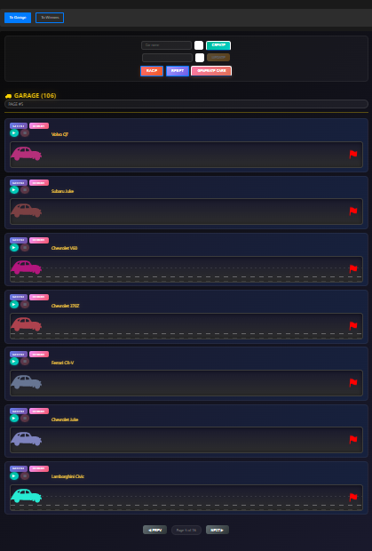
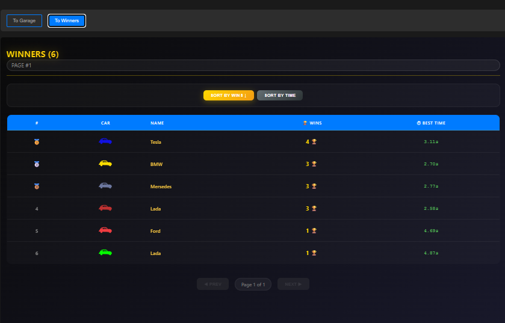
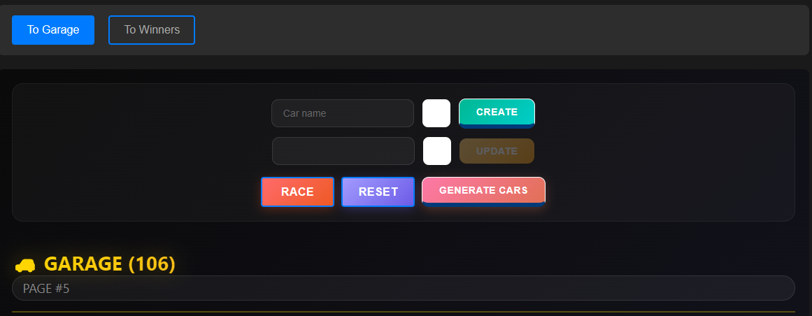

# Acync race

1. Task: https://github.com/rolling-scopes-school/tasks/blob/master/stage0.5%20Bootcamp/tasks/async-race/README.md
---

2. Screenshot:

---

3. Deployment: https://github.com/DaryaDudkova98/async-race.git

---

4. Done 25.08.2026 / deadline 30.08.2026

---

5. Score (600/600):

---

#### **Basic structure (240 points)**

##### **View configuration (80 points)**

- [x] Two main concepts: Garage and Winners **+25**;
- [x] Display of name, page number, and total number of machines **+15**;
- [x] The Winners view displays its name, current page number, and total number of records in the winners table **+15**;
- [x] View state is preserved when navigating between views: page number, input values, and selected color are not reset **+25**.

##### **Garage view functionality (160 points)**

- [x] CRUD for cars works: create, update, delete, list. Deleting a car removes it from both garage and winners tables **+60**;
- [x] Color is selected from an RGB palette and the selected color is reflected on the car's image **+25**;
- [x] Update and delete buttons are placed next to each car **+15**;
- [x] Pagination is implemented with 7 cars per page **+30**.

##### **Car generation (30 points)**

- [x] A button creates 100 random cars per click. Names are assembled from two random parts with at least 10 options per part; color is also random **+30**.

#### **Car animation (140 points)**

- [x] Start/stop engine buttons are placed next to each car **+25**;
- [x] Start engine animation - UI awaits the velocity response, animates the car, then issues the drive request. On 500 from drive, the animation stops in place **+60**;
- [x] Stop engine animation - UI awaits the stop response and the car returns to its initial position **+25**;
- [x] Button states - start is disabled while driving; stop is disabled at the initial position **+15**;
- [x] Animations remain fluid and visible at a 500px viewport width **+15**.

#### **Race animation (100 points)**

- [x] Start race button starts the race for all cars on the current page **+40**;
- [x] Reset race button returns all cars on the current page to their starting positions **+30**;
- [x] After the first car finishes, a winner message containing the car's name is shown **+30**.

#### **Winners view (120 points)**

- [x] After a race, the winning car appears in the Winners table **+40**;
- [x] Pagination is implemented with 10 winners per page **+30**;
- [x] The table has columns: №, image, name, number of wins, best time (in seconds). Win count increments on repeat wins; best time is updated only if the new time is better **+25**;
- [x] Sorting by number of wins and by best time works in both ascending and descending order **+25**.

- **Server:** https://github.com/mikhama/async-race-api